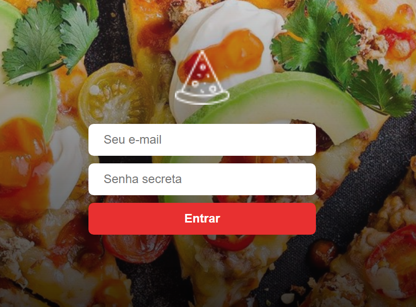

# Desafio Final 2 RocketSeat - Frontend

Nesse desafio foi construida uma aplicação completa envolvendo back-end com NodeJS, front-end com ReactJS e mobile com React Native.

A aplicação consiste em um app de controle de pedidos por delivery de uma pizzaria. O aplicativo móvel será utilizado pelos clientes da pizzaria para realizar pedidos e a versão web será utilizada para controle e registro dos pedidos realizados.

A versão web da aplicação será utilizada apenas para monitorar os pedidos conforme forem chegando e não terá versão para o cliente fazer pedido, apenas para administradores consultarem os pedidos já feitos.

O administrador vai listar os pedidos que ainda estão pendentes, podendo ter a opção de excluir o pedido ou marcar como pago.

No front-end da aplicação foi utilizado o create-react-app, estilização
através de Styled Components, Redux, Redux Saga.

O desafio Backend, que consiste em criar a mesma API, também foi feito, ele pode ser visto neste link:

https://github.com/dbins/rocketseat_desafiofinal2_backend

O desafio Mobile, que consiste em criar um aplicativo que vai alimentar os pedidos consultados por este frontend, pode ser visto neste link:

https://github.com/dbins/rocketseat_desafiofinal2_mobile

## Instalação

- git clone https://github.com/dbins/rocketseat_desafiofinal2_frontend
- npm install
- Iniciar a API.
- Altere o arquivo .env na raiz do projeto, informado o IP onde está rodando a API e o IP onde vai rodar este site.
- Iniciar a aplicação digitando npm start

## Scripts incluídos nesta aplicação

### npm start

Para iniciar a aplicação em modo de desenvolvimento

### npm run build

Para gerar a versão em modo de produção, dentro da pasta Build localizada na raiz do projeto é criada a versão para colocar no ar.

### npm run test

Para testes unitários em modo de desenvolvimento. Para os testes é utilzada a biblioteca Enzyme

## Rotas da API

A documentação da API pode ser consultada na página api.html localizada na raiz do projeto backend. Abaixo segue um resumo das rotas utilizadas pelo frontend:

| Rota        | Método | Descrição                            |
| ----------- | ------ | ------------------------------------ |
| /login      | POST   | Login do administrador               |
| /orders     | GET    | Lista pedidos feitos pelo aplicativo |
| /orders/:id | DELETE | Excluir um pedido                    |
| /orders/:id | PUT    | Marcar o pedido como pago            |

Para ativar a API, consulte o arquivo readme.md do repositório backend

## RECURSOS UTILIZADOS

* Axios
* Redux
* Saga
* Styled Components
* Links restritos
* ReactoTron

## Configurações React JS

### ESLINT

O ESLint é uma ferramenta de lint plugável para JavaScript e JSX

npm install eslint --save-dev
npx eslint --init

### Prettier
O Prettier atualiza seu código automaticamente seguindo os padrões que você quiser toda vez salva o arquivo;

npm install --save-dev --save-exact prettier

Instalação integração Prettier com ESlint
npm install --save-dev eslint-plugin-prettier
npm install --save-dev eslint-config-prettier

npm install --save-dev prettier eslint-config-prettier eslint-plugin-prettier

### Editor Config
O EditorConfig é um formatador de arquivos e coleções em forma de Plugin para Editores de código/texto com o objetivo de manter um padrão de código consistente entre diferentes editores, IDE's ou ambientes;

### Configurações

As configurações destes 3 recursos ficam disponíveis na raiz do projeto.

.editorconfig - Arquivo destinado à configuração do plugin Editor Config, que padroniza algumas configurações para o editor em diferentes ambientes;

.eslintrc.js - Arquivo de configuração do ESLint, é nele que são inseridas as regras e configurações de Linting do projeto

.babelrc - Arquivo de configuração do Babel, é nele que é configurado o Babel Plugin Root Import para aceitar imports absolutos na aplicação usando o diretório src como raiz;

